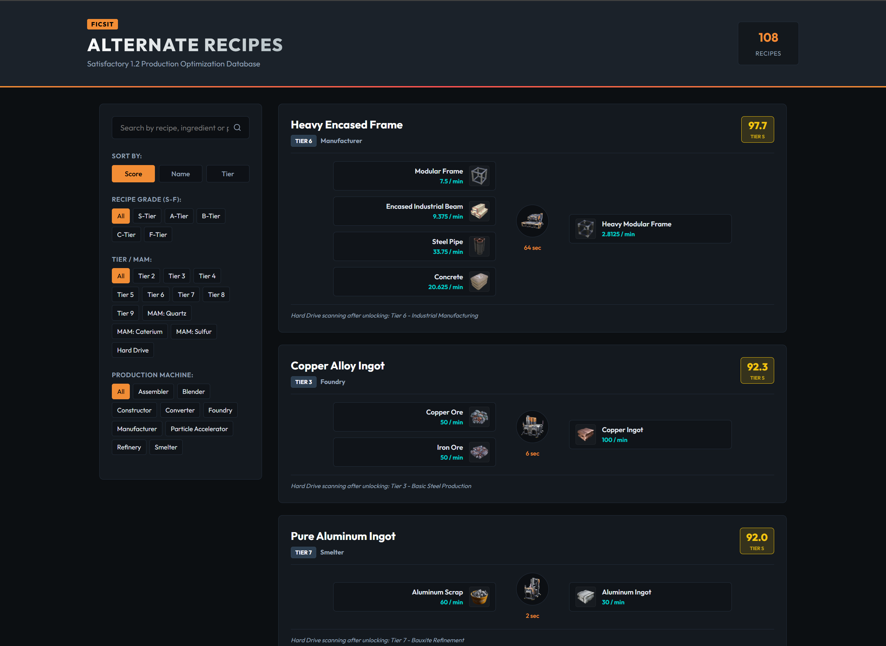

# Satisfactory Alternate Recipes Tierlist & Visualizer (v1.2)

An interactive, responsive, and completely self-contained alternate recipes database for **Satisfactory 1.2**. This tool visualizes production flows (Ingredients ➔ Machine ➔ Products) and ranks them using custom scores from the community spreadsheet.

## Live Demo
[Open Live Visualizer](https://bo1tro-1.github.io/Satisfactory-Alternate-Recipes-Tierlist/)

---

## Preview



---

## Features
*   **Production Flows:** View ingredients (and their consumption rates), products (and their production rates), and the machine required with its processing time.
*   **Community Ratings (S-F Tiers):** Recipes are ranked based on community scores and color-coded into S, A, B, C, and F Tiers to quickly determine their efficiency.
*   **Dynamic Filtering:** Filter recipes instantly by unlock Tier/MAM chain, or by production machine (Constructor, Assembler, Refinery, etc.).
*   **Instant Search:** Search in real-time by recipe name, ingredient name, or product name.
*   **Fully Offline & Self-Contained:** 
    *   The modular version works offline by opening `index.html`.
    *   A single-file bundle (`Satisfactory_Alternate_Recipes_Tierlist.html`) is available under **Releases**, with all CSS, JS, and **game asset images encoded directly in Base64** for a 100% offline, serverless experience.
*   **Mobile-First Responsive Design:** Optimized for both desktop monitors and mobile/tablet screens.

---

## How to Use

### Option A: Use it Online
Simply click the **Live Demo** link above to open it in your browser.

### Option B: Download and Run Offline (Recommended for gameplay)
1. Go to the **Releases** tab on the right side of this repository.
2. Download the standalone `Satisfactory_Alternate_Recipes_Tierlist.html` file.
3. Double-click the downloaded file. It will open in your browser and run completely local—no internet connection or folder structures required!

### Option C: Run the Modular Source Code
Clone the repository and open `index.html` directly in your browser:
```bash
git clone https://github.com/Bo1tro-1/Satisfactory-Alternate-Recipes-Tierlist.git
cd Satisfactory-Alternate-Recipes-Tierlist
# Open index.html in your browser
```

---

## Built With
*   **Core:** HTML5 & Vanilla ES6+ JavaScript.
*   **Styling:** Custom CSS3 with an industrial dark theme matching FICSIT aesthetics.
*   **Icons:** Scalable SVG Vector Icons (magnifying glass and navigation indicators).
*   **Data Scraper:** PowerShell automation script utilizing the official `wiki.gg` MediaWiki API to fetch and structure recipes and downscale game icons.

---

## Credits & Disclaimers
*   Recipe data and asset images are sourced from the **[Official Satisfactory Wiki](https://satisfactory.wiki.gg/)**.
*   Satisfactory game assets, images, and names are copyrights of **[Coffee Stain Studios](https://www.coffeestainstudios.com/)**.
*   Recipe scores and original spreadsheet ranking analysis created by **[u/wrigh516 on Reddit](https://www.reddit.com/r/SatisfactoryGame/comments/1fekus9/alternate_recipe_ranking_10_optimizing_for/)**.
*   Interactive visualizer tool built and maintained by **u/Vu1canio**.
